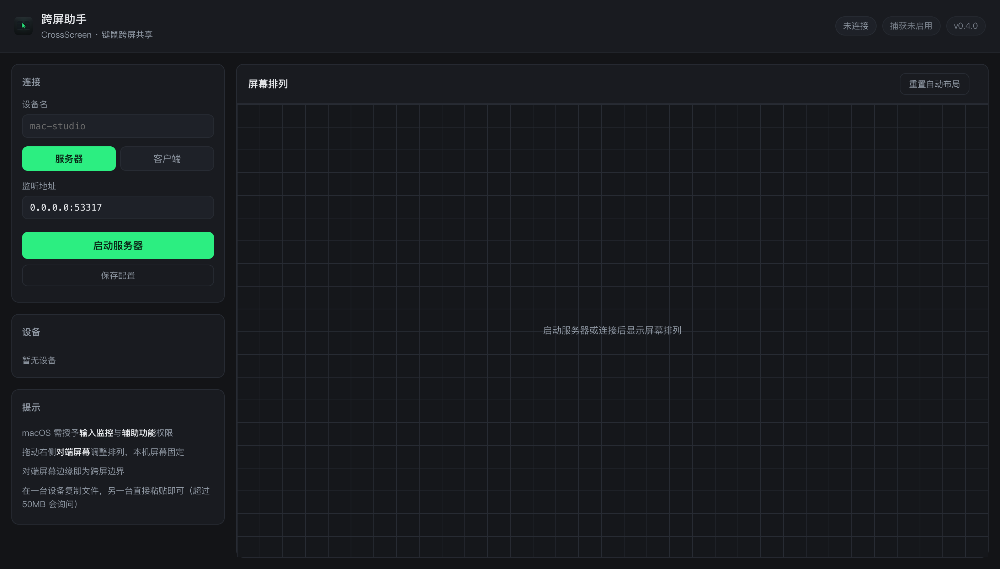

# CrossScreen · 跨屏助手

Share one keyboard and mouse across **macOS and Windows** over your local network — move the cursor to the edge of a screen and it keeps going on the next machine. Copy-paste text and files across devices, and even type your Windows lock-screen password from another machine.

跨屏键鼠共享：在局域网内共享一套键鼠控制 macOS 与 Windows，跨设备复制粘贴文本与文件，锁屏状态下也能从别的设备输入 Windows 密码。

[](https://github.com/ques666/CrossScreen/actions/workflows/build.yml)
[](https://github.com/ques666/CrossScreen/releases)
[](LICENSE)
[](go.mod)


---

## Screenshots / 截图

浏览器控制台：管理节点启停、设备与屏幕排列、文件传输与锁屏输入服务。



---

## Installation / 安装

从 [Releases](https://github.com/ques666/CrossScreen/releases) 下载对应平台的安装包：

| 平台 | 文件 | 说明 |
|---|---|---|
| macOS | `CrossScreen-macos-universal.zip` | 通用二进制（Apple Silicon + Intel），最低 macOS 12，已签名 |
| Windows | `CrossScreen-windows-amd64.exe` | amd64，免安装，直接运行 |

### macOS

1. 下载 `CrossScreen-macos-universal.zip`，解压后把 `CrossScreen.app` 拖入「应用程序」。
2. 双击运行（首次启动会自动打开浏览器控制台）。
3. 在 **系统设置 → 隐私与安全性** 中授予 **输入监控** 与 **辅助功能** 权限（否则无法捕获/注入键鼠）。

### Windows

1. 下载 `CrossScreen-windows-amd64.exe`，双击运行，浏览器会自动打开控制台（`http://127.0.0.1:8080`）。
2. 如需在 **锁屏界面** 输入密码，在控制台的「锁屏控制服务」中点击 **安装服务** 即可。

---

## Features

- **Seamless input sharing** — the screen edge is the crossing boundary; a shared virtual layout maps each display, so the cursor and keyboard follow naturally from one machine to the next.
- **Copy & paste across devices** — text syncs through the clipboard bridge; files are streamed in chunks and materialized into a sandbox so you can paste the reference anywhere.
- **LAN auto-discovery** — peers find each other over UDP broadcast; no manual IP juggling in typical setups.
- **Browser control panel** — an embedded HTTP server + status-bar/tray icon; manage the node, auto-start and the Windows lock-screen service without any separate install.
- **Windows lock-screen input** — a SYSTEM service spawns an agent directly on the *Winlogon* (secure) desktop over a restricted named pipe, so injected keyboard input reaches the lock screen (password entry included). Direct SendInput cannot do this.

## Supported platforms

| Platform | Role | Notes |
|---|---|---|
| macOS | Host / client | Universal binary (arm64 + x86_64), min **macOS 12** (Go runtime floor) |
| Windows | Host / client | amd64; optional elevated lock-screen service |

## Getting started

Run `CrossScreen` on each machine. The first launch opens the control panel in your browser (`http://127.0.0.1:8080`). Move the pointer to the edge of a screen — it appears on the other machine and both share the same keyboard.

On macOS, grant **Input Monitoring** and **Accessibility** permissions when prompted (required for capture/injection).

## Build

### macOS

```sh
scripts/build-mac.sh
```

Produces `dist/mac/CrossScreen.app` as a universal binary (arm64 + x86_64) with an explicit macOS 12 deployment target and ad-hoc signing.

### Windows

```sh
GOOS=windows GOARCH=amd64 CGO_ENABLED=0 go build -trimpath -ldflags="-H=windowsgui -s -w" -o CrossScreen.exe ./cmd/crossscreen
```

## Windows lock-screen input

When the machine is locked, Windows switches to the *Winlogon* secure desktop, which rejects input injected from a normal user session. CrossScreen solves this with:

1. A **SYSTEM service** (`CrossScreenInputService`) that derives a SYSTEM token from `winlogon.exe` and launches an **agent process directly on the Winlogon desktop** (`CreateProcessAsUser` + `lpDesktop="winsta0\Winlogon"`).
2. A **named pipe** `\\.\pipe\CrossScreenInput` (SDDL-restricted to SYSTEM/Administrators) carrying neutral input events from the interactive app to the agent.
3. The **agent** performs `SendInput` from its Winlogon-desktop thread, so keystrokes reach the lock screen. (A runtime `SetThreadDesktop` to the secure desktop is silently dropped on modern Windows — the process must be *created* there.)

The service is optional and installed from the control panel; without it, lock-screen keyboard input is unavailable but the normal desktop still works.

## Repository layout

```
cmd/crossscreen      main entry (panel, headless node, svc/agent/diag modes)
core/                protocol, session, transport, discovery, layout, keymap
platform/            OS-specific adapters: capture, inject, clipboard, tray,
                     file transfer, control panel web UI, winsec
scripts/             build scripts
tools/genicons/      icon renderer
```

## License

[Apache License 2.0](LICENSE)

---

## 中文简介

**CrossScreen（跨屏助手）** 让你在局域网内用一套键鼠流畅地控制多台设备：光标滑到屏幕边缘即跨越到下一台设备，键盘输入随之跟随；剪贴板桥接实现跨设备文本复制，文件分块传输并在接收端沙箱落地；内置网页控制台与托盘图标，支持开机自启与局域网自动发现。

针对 Windows 锁屏的键盘输入（输入密码），项目实现了完整方案：SYSTEM 服务从 `winlogon.exe` 派生令牌，用 `CreateProcessAsUser` 把代理进程**直接创建在 Winlogon 安全桌面**上，通过仅限 SYSTEM/管理员访问的命名管道接收事件并注入 —— 这是用户态 `SendInput` 无法做到的（现代 Windows 会静默丢弃运行时 `SetThreadDesktop` 切换到安全桌面的注入）。

支持 macOS（通用二进制，最低 macOS 12）与 Windows。控制台提供锁屏服务安装按钮，未安装该服务时锁屏键盘不可用，但普通桌面功能不受影响。

## 协议

本项目使用 [Apache License 2.0](LICENSE) 开源。
